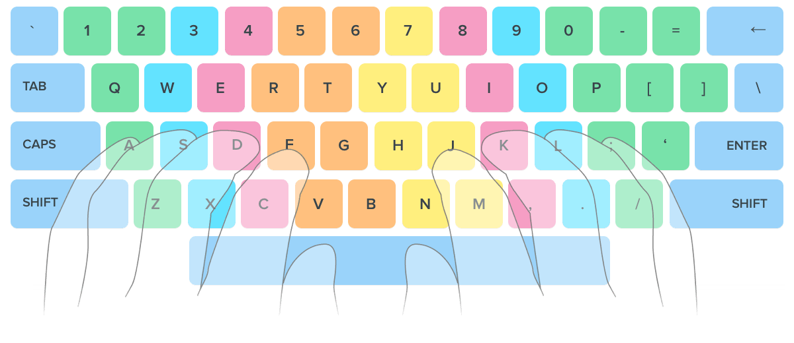

# Touchtype-trainer

    
    

A simple python script to train you to improve typing speeds
#
### :page_facing_up: Usage
1. `pip install -r requirements.txt`
2. `python3 touchtype.py <letters>`
   eg. `python3 touchtype.py asdfghjkl;` to practice qwerty home row
3. The rest should be fairly self explanatory
4. Profit?

#
### :test_tube: Todo:
- [x] Get it working
- [ ] Add brackets surrounding random bits of text
- [ ] Add punctuation